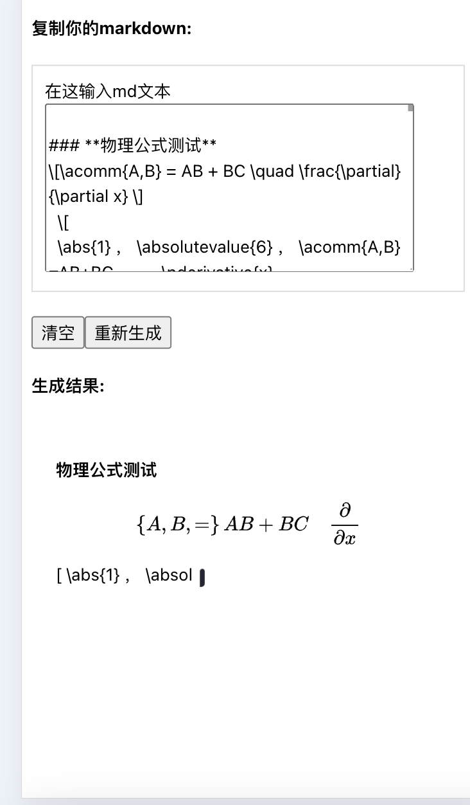
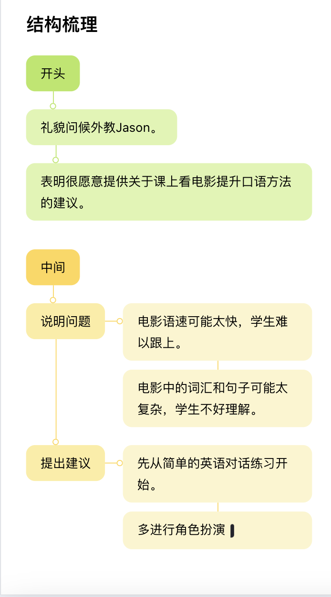

# markdown-it-sse-template
基于`markdown-it`（[文档](https://www.npmjs.com/package/markdown-it)，渲染sse流式输出的模版

# 对应掘金文章
https://juejin.cn/post/7451877734709575715

# 扩展的功能
1. 引入了`latex`公式渲染工具-`mathjax`
2. `markdown-it`中，对`latex`公式的流式处理及渲染
3. 自定义的块级元素（demo中为思维导图的渲染）
4. 流式渲染时，填加尾部光标

# node
`node` >`20`

# 运行
`npm run serve`

# 项目截图

